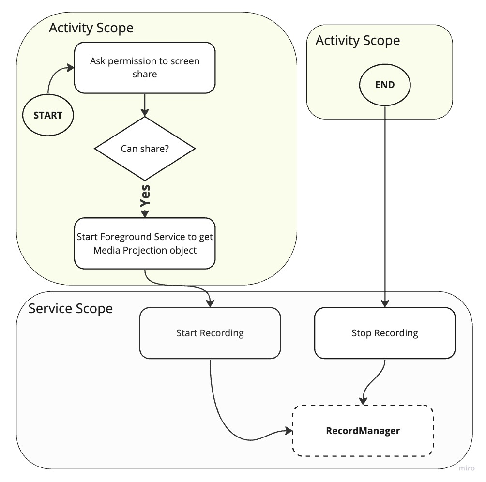

# Screen Share Recorder

## Use case

- Record the screen

---

## Components

### Activity

The place where we will create the screen capture intent. This intent result is used to create the foreground service `ScreenCaptureForegroundService`.

### Foreground Service

This component will support two actions (triggered by `MainActivity`): *start recording*, and *stop recording*.

### Recorder components

The code provides two recorder approaches: sync, and async.

#### Sync

This approaches is using `MediaMuxer` to write the buffer info, and the `MediaCodec` to encode the video streamings.

#### Async

Uses `MediaRecorder` API, we don't need to deal with all the complexity of the previous approach.

---

### Run

- To record your screen you just need to tap in Start button, the Stop button will be enabled after you start a recording. Currently we are **saving** the **recording** inside of the **Downloads** directory.

